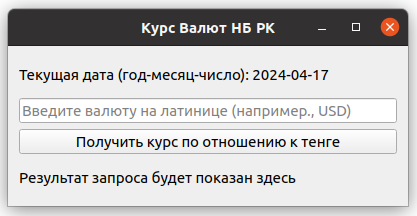
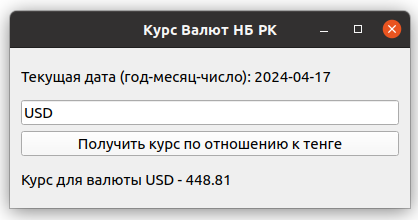

#  Daily currency rates from the National Bank of Kazakhstan

This application fetches daily currency exchange rates to KZT using the National Bank of Kazakhstan's website at:   
[https://nationalbank.kz/ru/exchangerates/ezhednevnye-oficialnye-rynochnye-kursy-valyut](https://nationalbank.kz/ru/exchangerates/ezhednevnye-oficialnye-rynochnye-kursy-valyut)

App uses [BeatifulSoup4](https://pypi.org/project/beautifulsoup4/) fo fetch currency rate data and [PyQT5](https://pypi.org/project/PyQt5/) to build the cross-platform GUI

## Installation

```bash
pip install -r requirements.txt
```

To get the binary file use:
```bash
pyinstaller --onefile --windowed src/app.py
```

## Screenshots



